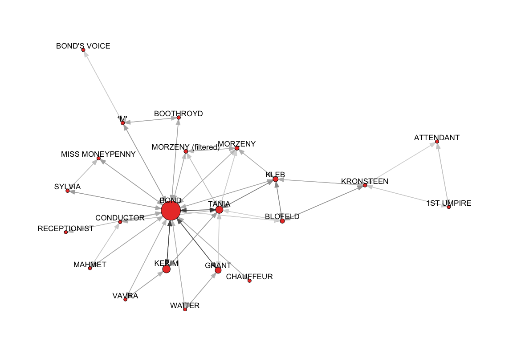
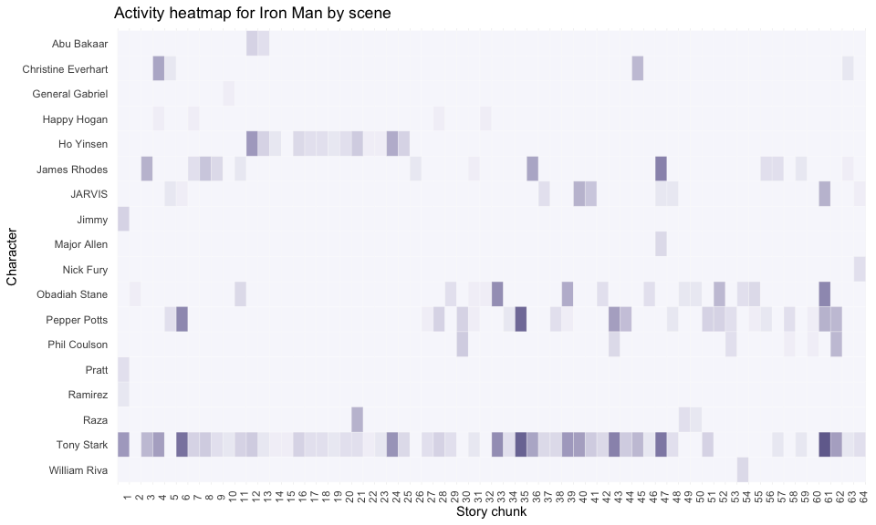
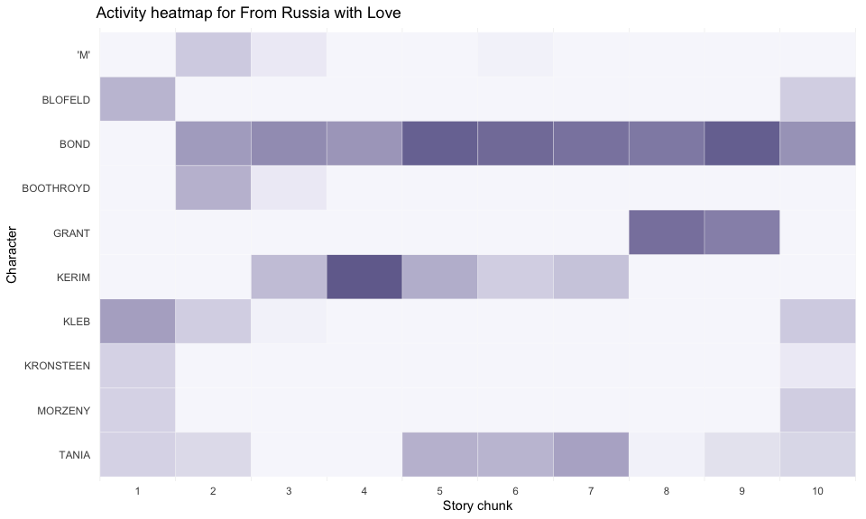

<!-- README.md is generated from README.Rmd. Please edit that file -->

# charinet 

<!-- badges: start -->

[](https://travis-ci.com/pj398/charinet)
[](https://cran.r-project.org/package=charinet)
<!-- badges: end -->

This package provides a handful of tools for working with character
interaction network data in R.

Below are an important note on the data structure the package is
designed to work with and a full demo of the key functions. The demo
will make use of the data in the
[`movienetdata`](https://github.com/pj398/movienetdata) package, which
contains character interaction data from a number of popular films.

If you have any questions or issues that aren’t answered by this
walkthrough, please [contact me](mailto:petejones398@gmail.com) or
[raise an issue](https://github.com/pj398/charinet/issues).

## Installation

You can install the development version from
[GitHub](https://github.com/) with:

``` r
# install.packages("devtools")
devtools::install_github("pj398/charinet")
```

## Data structure

Key to using the package is understanding the expected format of the
character interaction data. Most of the package functionality is based
on the understanding that character interactions are stored in a
time-ordered multicast event list. This means a data structure wherein
each row is a discrete interaction, with row *r* occuring after row
*r-1* and before *r+1* in the narrative text. Because interactions are
generally multicast (they only have one sender, but can and often do
have multiple receivers), the data structure should contain a column
indicating the ID of the sender (e.g. for dialogue data, this would be
the speaking character), immediately followed by columns containing
dummy variables for whether each character is the recipient of a given
line of dialogue.

An example of this is shown below:

| eventID | sender | Character 1 | Character 2 | Character 3 | Character 4 |
|:-------:|:------:|:-----------:|:-----------:|:-----------:|:-----------:|
|    1    |   1    |      0      |      1      |      0      |      0      |
|    2    |   2    |      1      |      0      |      0      |      0      |
|    3    |   1    |      0      |      1      |      1      |      1      |
|    4    |   3    |      1      |      1      |      0      |      0      |

In this example, there are four discrete interactions: Character 1
addresses Character 2, then Character 2 addresses Character 1, then
Character 1 addresses Characters 2, 3 and 4 simultaneously, then
Character 3 addresses Characters 1 and 2. The utility of this structure
is that it clearly reflects the multicast nature of the events as there
is only one row per event, and thus does not ask us to impose a
pseudo-dyadic structure upon the interactions. For data which already
exists in a dyadic format (with “from” and “to” columns for each event),
the helper function `dyadic_to_multicast` (outlined below) converts this
to the multicast format.

It is worth making this structure absolutely clear because many of the
functions in the package depend on it. Many functions take an argument
`from`, which specifies the number of the column indicating sender ID
numbers. In the example above, this would be `from = 2`, as the sender
ID column is the second column. The function will then expect the dummy
for character 1 to be in column *from+1*, the dummy for character 2 to
be in column *from+2*, etc. Where there are other event-level variables
of interest (for example, a scene ID variable, or a variable containing
the text of what was said in an interaction), these should therefore be
included as columns **prior to** the column indicating the sender IDs.

## Demo

### Loading ready-made data:

First, let’s read in the character interaction network data for *Iron
Man* (2008).

``` r
iron_man <- movienetdata::mcu01_ironman
```

This data is a list containing three elements:

``` r
names(iron_man)
#> [1] "event_list" "node_list"  "adjacency"
```

The data look like so (only the first few columns are shown here for
clarity):

``` r
head(iron_man$event_list[, 1:6])
#>      eventID sceneID speakerID Tony.Stark..1. Jimmy..2. James.Rhodes..3.
#> [1,]       1       1         1              0         1                0
#> [2,]       2       1         2              1         0                0
#> [3,]       3       1         1              0         1                0
#> [4,]       4       1        14              1         0                0
#> [5,]       5       1         1              0         0                0
#> [6,]       6       1        14              1         0                0
```

``` r
iron_man$node_list
#>    char_ID          char_name char_female nlines linesin
#> 1        1         Tony Stark           0    353     368
#> 2        2              Jimmy           0      5      11
#> 3        3       James Rhodes           0     68      64
#> 4        4      Obadiah Stane           0     80      62
#> 5        5 Christine Everhart           1     25      28
#> 6        6        Happy Hogan           0      4       7
#> 7        7             JARVIS           0     38      40
#> 8        8       Pepper Potts           1    123     135
#> 9        9    General Gabriel           0      1       2
#> 10      10          Ho Yinsen           0     60      54
#> 11      11         Abu Bakaar           0      8       3
#> 12      12               Raza           0     15      12
#> 13      13       Phil Coulson           0     24      25
#> 14      14            Ramirez           1      2       5
#> 15      15        Major Allen           0      4       2
#> 16      16       William Riva           0      4       3
#> 17      17              Pratt           0      3       6
#> 18      18          Nick Fury           0      3       2
```

### Reading in data from a PDF of a screenplay:

One of the main tools of this package is a screenplay parser function
`screenplay_to_events` which will extract character interactions from a
PDF of a well-formatted screenplay.

This function uses regular expressions, and is thus heavily dependent on
the screenplay following conventional [screenplay formatting
standards](https://www.finaldraft.com/learn/how-to-format-a-screenplay/).
Behind the scenes, it tags each line of the screenplay based on whether
it matches regular expressions corresponding to the different
identifiable elements of a screenplay such as scene boundaries,
character names and dialogue.

Some caveats: many of these regular expressions depend on indentation,
so the function won’t work on screenplays that do not use consistent
indentation patterns (or which do not indent at all). The function is
also likely to fail if the PDF is watermarked, as this interferes with
the ability to detect text clearly in the PDF. Finally, the presence of
conventional annotations such as “(V. O.)” and “(O. S.)” are used to
help identify which elements are the lines corresponding to speaking
character names, and so the parser may not work if there are no such
annotations in the screenplay (this would be unusual but worth
mentioning).

To show the function in action, we’ll use it to read in the screenplay
for *From Russia with Love* (1963), downloaded from
[here](https://bulletproofscreenwriting.tv/james-bond-movies-collection-screenplay-download/).

``` r
library(charinet)
frwl_events <- screenplay_to_events(pdf_file = paste0(my_local_dir, "frwl.pdf"), 
                                    window = 5)
```

When converting the tagged screenplay into a multicast event list, the
parser uses the relatively easily-identified speaking characters to
populate the sender ID column. However, it is not possible to accurately
capture the receiving characters of a line of dialogue from a
screenplay, so the parser uses proximity to determine who the
‘receivers’ of an interaction are. The `window` argument specifies the
size of the context window for this proximity. For a given line of
dialogue *t* in scene *s*, the parser will look for any other characters
who spoke within `window` number of lines of *t* within the same scene
*s*, and assign them as recipients of line *t*.

### Some helper functions

The package has a few helper functions for extracting useful information
from the data. To make our newly extracted *From Russia with Love* data
more analogous to the ready-made *Iron Man* data, we can generate a
nodelist and an adjacency matrix from `frwl_events`.

``` r
frwl_nodes <- nodes_from_events(event_list = frwl_events, 
                                from = 3, 
                                receivers = FALSE)
```

Note that `from` is set to 3, because the sender ID column in
`frwl_events` is the third column. The `receivers = FALSE` argument
tells the function that our data doesn’t contain real receivers (we’re
only approximating), so there’s no need to include a variable in the
node list for the number of times each character is the recipient of a
line of dialogue. When the input data does contain truly directed
events, `receivers = TRUE` will add this variable to the nodelist.

``` r
# Peek at the nodelist, ranked by number of lines spoken
head(frwl_nodes[order(frwl_nodes$nlines, decreasing = TRUE), ])
#>    charID char_name nlines
#> 19     19      BOND    305
#> 28     28     KERIM    103
#> 14     14     TANIA     87
#> 51     51     GRANT     71
#> 10     10      KLEB     45
#> 9       9   BLOFELD     27
```

And now we can aggregate the events into an adjacency matrix format:

``` r
frwl_adj <- adj_from_events(event_list = frwl_events)

# Peek at the first few characters
frwl_adj[1:6, 1:6]
#>                   MORZENY MATCH    FINAL KRONSTEEN 1ST UMPIRE ATTENDANT
#> MORZENY                 0              0         0          0         0
#> MATCH    FINAL          0              0         1          1         1
#> KRONSTEEN               0              1         0          1         1
#> 1ST UMPIRE              0              1         2          0         3
#> ATTENDANT               0              1         1          3         0
#> 'YOU ARE REQUIRED       0              1         1          1         1
#>                   'YOU ARE REQUIRED
#> MORZENY                           0
#> MATCH    FINAL                    1
#> KRONSTEEN                         1
#> 1ST UMPIRE                        3
#> ATTENDANT                         3
#> 'YOU ARE REQUIRED                 0
```

### Plotting as a network

The package contains a function `plot_charinet` which can produce a
quick network visualisation of the character interaction data using
[`ggraph`](https://github.com/thomasp85/ggraph/).

``` r
plot_charinet(adjacency = iron_man$adjacency, 
              char_names = iron_man$node_list$char_name, 
              degree = iron_man$node_list$nlines, 
              node_fill = ifelse(iron_man$node_list$char_female, 
                                 "#ded649", "#55467a"), 
              parallel_edges = TRUE, 
              title = "Dialogue in Iron Man (2008)")
```


Note that the `degree` argument takes a vector of numeric values
(ordered by character ID) to be used to scale the relative size of
nodes, and the `node_fill` argument can take a character vector of
colour names to be used to colour nodes (in this case based on gender)
or a single character string containing a colour name for colouring all
nodes the same colour.

Note the behaviour of the argument defaults (this time using *From
Russia with Love*):

``` r
plot_charinet(adjacency = frwl_adj, 
              cutoff = 10)
```



In this example, the `cutoff` argument was used to restrict the network
to only those characters who speak more than 10 lines overall (which is
useful for filtering our many of the noisy unnamed characters detected
from the screenplay parser).

Also, as we didn’t specify `parallel_edges = TRUE`, the plot reverted to
the default behaviour of plotting double-sided arrows instead of two
parallel arrows for directed ties.

### Activity heatmaps

The package contains functions for calculating and plotting
character-by-story-chunk activity heatmaps. Story chunks can be any
division of the event list into chunks - either by pre-defined divisions
such as scenes or chapters, or by arbitrary division into a number of
evenly-sized chunks.

First, we’ll generate a heatmap for *Iron Man* which looks at character
activity (lines spoken) in each scene.

``` r
iron_man_hm <- activity_heatmap(event_list = iron_man$event_list, 
                                char_names = iron_man$node_list$char_name, 
                                story_chunk_col = 2, 
                                from = 3)
```

Here, we specified that the column containing the story chunk IDs (in
our case the “sceneID” column) is the second column, and the speaker IDs
are in the third column.

To illustrate another approach, we can generate a heatmap for *From
Russia with Love* which divides the narrative into 10 chunks.

``` r
frwl_hm <- activity_heatmap(event_list = frwl_events, 
                            n_chunks = 10, 
                            from = 3)
```

These character-by-chunk matrices are useful on their own, but most
revealing when visualised as a heatmap. The plot\_heatmap function
provides a quick way to do this using `ggplot2`:

``` r
plot_heatmap(iron_man_hm, title = "Activity heatmap for Iron Man by scene")
```



This illustrates that Tony Stark is vocally active throughout the entire
film, while other characters such as Ho Yinsen and Pepper Potts are
active in different acts of the film.

The *From Russia with Love* heatmap produces a less fine-grained way of
looking at the narrative:

``` r
plot_heatmap(frwl_hm, cutoff = 10, title = "Activity heatmap for From Russia with Love")
```



Here we again use the `cutoff` argument to limit the visualised data to
only those characters who speak more than 10 lines.

### Narrative centrality

Finally, the package implements the narrative centrality measure for
character interaction network data introduced in Jones, Quinn and
Koskinen (2020). The measure can calculate the speaking or spoken-to
centrality scores of network actors in a time-ordered multicast event
list. In either case, all characters begin with the same non-zero score.
In the speaking mode, when a character speaks, their score increases by
a fraction of the score of the character they speak to (when addressing
multiple recipients, the speaker’s score increases by a fraction of the
mean of the addressees’ scores). In the spoken-to mode, when a character
is spoken to, their score increases by a fraction of the score of the
character speaking to them.

The package implements the measure like so:

``` r
iron_man_scores <- narrative_centrality(event_list = iron_man$event_list, 
                                        char_names = iron_man$node_list$char_name,
                                        mode = "both", 
                                        wp = 0.01,
                                        normalised = TRUE, 
                                        from = 3)
```

Here `mode` is used to specify either “in”, “out”, or “both”. For
`mode = "in"`, only spoken-to scores are returned; for `mode = "out"`,
only speaking scores are returned; for `mode = "both"`, a list
containing both is returned.

``` r
names(iron_man_scores)
#> [1] "out_scores" "in_scores"
```

The `wp` argument is used to specify the fraction used when increasing
character scores. The higher the value, the more sensitive the measure
is as characters can overtake other characters’ scores after fewer
interactions. The default value of 0.01 means that when characters
interact, their scores increase by 1% of the score of those with whom
they interact.

Finally, the character scores are normalised (`normalised = TRUE`) by
dividing each characters’ score at time *t* by the sum of all character
scores at time *t*, such that scores become each character’s relative
share of the overall centrality.

These scores can then be plotted using `plot_nc`:

``` r
plot_nc(iron_man_scores$out_scores, 
        title = "Speaking centrality scores for characters in Iron Man (2008)")
```


By default, only characters whose (normalised) scores at the end of the
narrative are greater than their scores at the beginning of the
narrative are labelled. This can be overridden using `label_all = TRUE`.

### Reshaping event lists between dyadic and multicast formats

As noted earlier, the package expects a specific format that is not
commonly found in the wild. Thus, the package provides two more helper
functions for converting between dyadic and multicast event lists. In
the dyadic format, each row is a dyadic interaction, with a “from”
(sender) column and a “to” (receiver) column. There may also be a “time”
or “event” column which indexes the sequence of events.

Sometimes, it may be useful to convert the multicast event list to this
dyadic format, for example so that it can be used with another package’s
functions which expect an edge-list style data structure.

This can be done like so:

``` r
iron_man_dyadic <- multicast_to_dyadic(iron_man$event_list, 
                                       from = 3, 
                                       force_seq = TRUE)

head(iron_man_dyadic)
#>      time eventID sceneID from to
#> [1,]    1       1       1    1  2
#> [2,]    2       1       1    1 14
#> [3,]    3       1       1    1 17
#> [4,]    4       2       1    2  1
#> [5,]    5       3       1    1  2
#> [6,]    6       4       1   14  1
```

Note that the `force_seq` argument, if set to TRUE, will force events
with multiple receivers into a false sequence, so that all events in the
dyadic event list have a different event ID. In the *Iron Man* example
above, this can be seen in the difference between the `time` variable
and the `eventID` variable - the `time` variable computed by the
function treats every dyadic event as happening subsequent to the
previous one. When `force_seq = FALSE`, these multicast events will
still be split into the dyadic components, but the computed `time`
variable will indicate that these dyadic events are simultaneous (in the
above example the `time` variable would be identical to the `eventID`
variable).

The more common case would be to convert this kind of dyadic format into
the multicast format expected by `charinet`. This is done like so:

``` r
iron_man_multicast <- dyadic_to_multicast(iron_man_dyadic, 
                                          from = 4, 
                                          to = 5, 
                                          time_col = 2, 
                                          char_names = iron_man$node_list$char_name)

iron_man_multicast[1:6, 1:6]
#>      eventID from Tony Stark Jimmy James Rhodes Obadiah Stane
#> [1,]       1    1          0     1            0             0
#> [2,]       2    2          1     0            0             0
#> [3,]       3    1          0     1            0             0
#> [4,]       4   14          1     0            0             0
#> [5,]       5    1          0     0            0             0
#> [6,]       6   14          1     0            0             0
```

Note that we specify both the `from` and `to` column indices, as well as
a `time_col` indicating the column to be used to collect the timing of
events. In this case, we specified `eventID` (column 2), because this is
the column that captures the fact that some of the dyadic interactions
are simultaneous (they are actually part of a multicast interaction). If
we had specified `time_col = 1`, every event in the multicast event list
would have exactly 1 sender and 1 receiver, preserving the false
sequence we forced when creating `iron_man_dyadic`. When a `time_col` is
specified, the function will collect these dyadic interactions spread
across multiple rows in the dyadic event list and place them in the same
row in the multicast event list. Thus, `iron_man_multicast` is
equivalent to the `iron_man$event_list` we started with:

``` r
identical(rowSums(iron_man_multicast[ , 2:ncol(iron_man_multicast)]), 
          rowSums(iron_man$event_list[ , 3:ncol(iron_man$event_list)]))
#> [1] TRUE
```

## References

Jones, P., E. Quinn and J. Koskinen. 2020. “Measuring centrality in film
narratives using dynamic character interaction networks.” *Social
Networks* 63: 21-37. DOI:
[10.1016/j.socnet.2020.03.003](https://doi.org/10.1016/j.socnet.2020.03.003).
